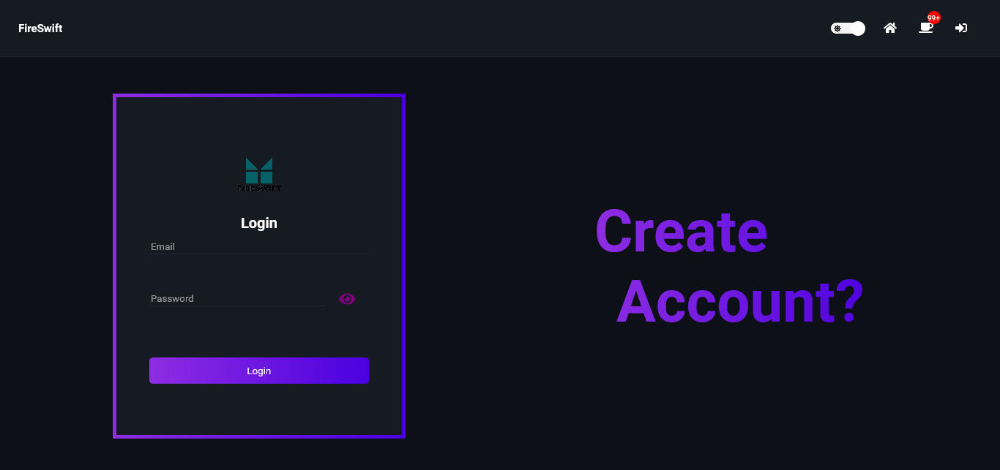

<p align="center">
    </img>
    <h2 align="center" >FireSwift</h2>
</p>

A social media created with firebase and redux.

---

### Brief

Connected users will be able to share their posts, have a real-time conversation, add friends, react and comment to posts.
Non-connected users will only be able to see the posts, no person's profile or chat.

---

### Libraries in use

- React
- React router dom
- React hook form
- Redux
- React-redux
- Redux toolkit
- Font Awesome Icons
- Firebase
- React toastify
- React switch

---

### Snapshots

<p align="center">
    <h2 align="center" >Login page</h2>
    </img>
</p>

---

### Progress

- [x] Create main page styles
  - [x] Header
  - [x] Friends' list
  - [x] Feed
- [x] Create login page styles
- [x] Create page for account creation styles
- [x] Create page for chats
- [x] Create page for user profile
- [x] Integrate with firebase
- [x] Login
- [x] Account creation
- [x] Add redux 
- [x] Add/remove friends mechanism
- [ ] Create posts mechanism

---

### How to contribute

```
    >> Fork this repository

    >> Create a new branch containing your feature
    git checkout -b feature

    >> Commit your changes
    git commit -m "new feature"

    >> Push to your branch
    git push origin feature

    >> After your pull request's merge has been done, you can delete your branch

```

---

### Author

- Website - [Romario Negreiros](https://romario-negreiros.github.io/Romario-frontend/)
- Frontend Mentor - [@Romario-Negreiros](https://www.frontendmentor.io/profile/Romario-Negreiros)
